# Setup Multiple Flavors

## ***`Formation`***

### Android

First, setup specific `applicationId` for different flavors in `android` block in `android/app/build.gradle`:

```gradle
flavorDimensions "app"
productFlavors {
    insix {
        dimension "app"
        applicationId "dev.techfusion.insix"
    }
    
    crushit {
        dimension "app"
        applicationId "dev.techfusion.crushit"
    }
}
```

That will handle our app identifier, for now we need to still update **app name** for each version in `android/app/src/main/AndroidManifest.xml` add `app_name`:

```xml
<application
        android:label="@string/app_name"
        ...
>
```

Then create env strings:

```xml
<!-- android/app/src/insix/res/values/strings.xml -->

<?xml version="1.0" encoding="utf-8"?>
<resources>
    <string name="app_name">IN SIX</string>
</resources>
```

```xml
<!-- android/app/src/crushit/res/values/strings.xml -->

<?xml version="1.0" encoding="utf-8"?>
<resources>
    <string name="app_name">CRUSH IT</string>
</resources>
```

### iOS

To set up flavors in iOS once again we’ll need to switch to Xcode to manage schemes.

Xcode ⇒ Product ⇒ Scheme ⇒ New scheme, target stays Runner and add two schemes `insix` and `crushit`

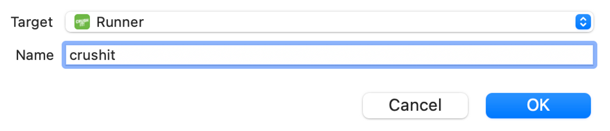

After this, go to Project > Runner and duplicate the Debug, Release, and Profile configurations for each scheme.

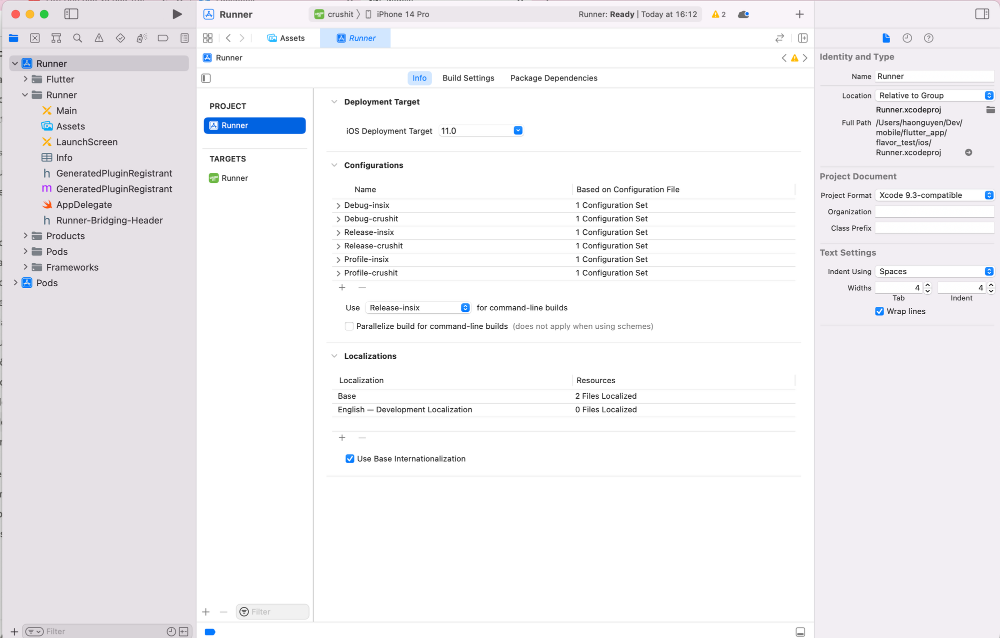

Make sure each scheme now points to correct configurations (just right click on scheme and edit)

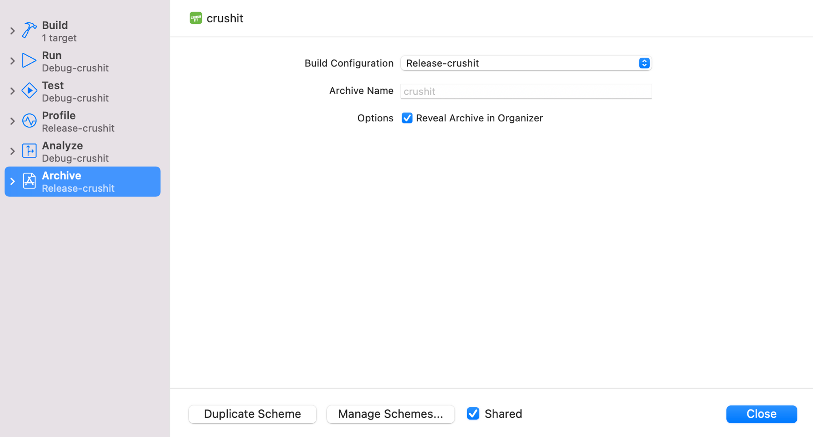

Go to Target > Runner > Build Settings > Packaging > Product Bundle Identifier to update for each flavor:

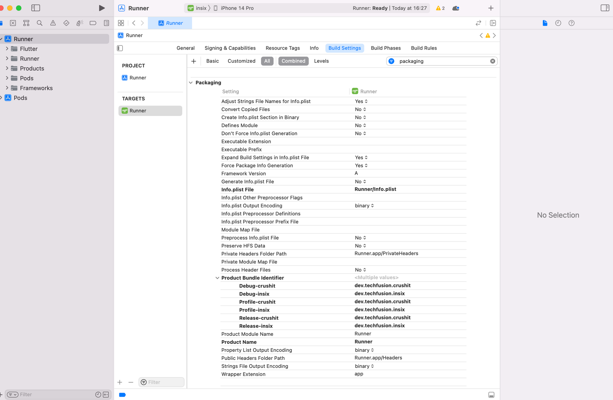

And **Add new User defined settings** for APP_DISPLAY_NAME and update the name each flavor.

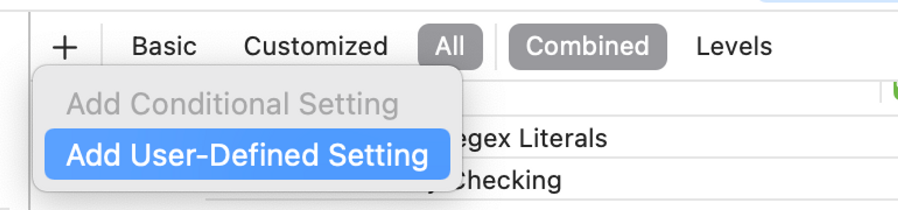


Also add this variable in InfoPlist for the bundle display name.

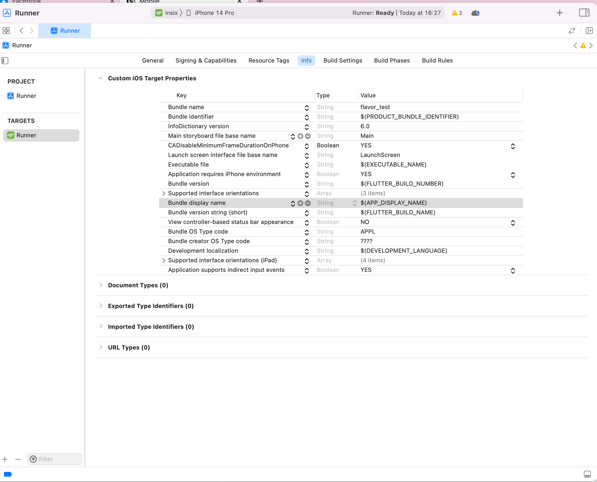

## ***`Launcher Icon`***

Install [flutter launcher icons](https://pub.dev/packages/flutter_launcher_icons) package.

Create `flutter_launcher_icons-{flavor}.yaml` in the root directory. Pay attention to the naming (must be a dash, not an underscore); the flavor suffix is important for it to be compatible with each flavor's asset folder.


```groovy
flutter_icons:
    android: "launcher_icon"
    ios: true
    remove_alpha_ios: true
    image_path: "assets/launcher/insix_logo.png"
```

Run the next command:

```bash
flutter pub run flutter_launcher_icons:main -f flutter_launcher_icons*
```

### Android

You're done! No, really, Android doesn't need any additional setup.

### iOS

We need to do this manual for iOS, go to Target > Runner > Build Settings > Asset Catalog Complier - Options > Primary App Icon Set Name:

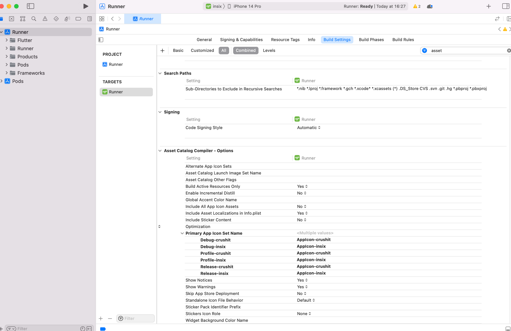

## ***`Launch Screen`***

Install [flutter_native_splash](https://pub.dev/packages/flutter_launcher_icons) package.

Create `flutter_native_splash-{flavor}.yaml` in the root directory. Pay attention to the naming (must be a dash, not an underscore)

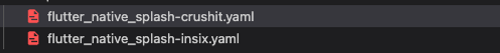

```bash
flutter_native_splash:
    color: "#0d0d0e"
    image: "assets/launcher/insix_logo.png"
```

Run the next command:

```bash
# For insix flavor
flutter pub run flutter_native_splash:create --flavor insix --path=flutter_native_splash-insix.yaml

# For crushit flavor
flutter pub run flutter_native_splash:create --flavor crushit --path=flutter_native_splash-crushit.yaml
```

### Android

You're done! No, really, Android doesn't need any additional setup.

### iOS

Find the newly created Storyboard files at the same location where the original is `/ios/Runner/Base.lproj` (LaunchScreen.storyboard is default)

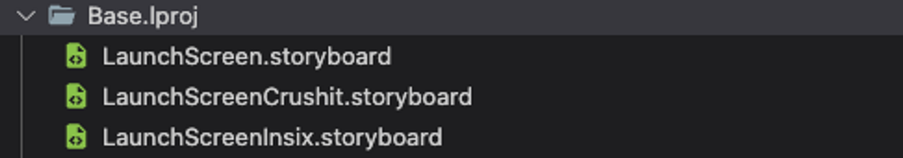

Select all of them and drag and drop into Xcode, directly to the left hand side where the current LaunchScreen.storyboard is located already

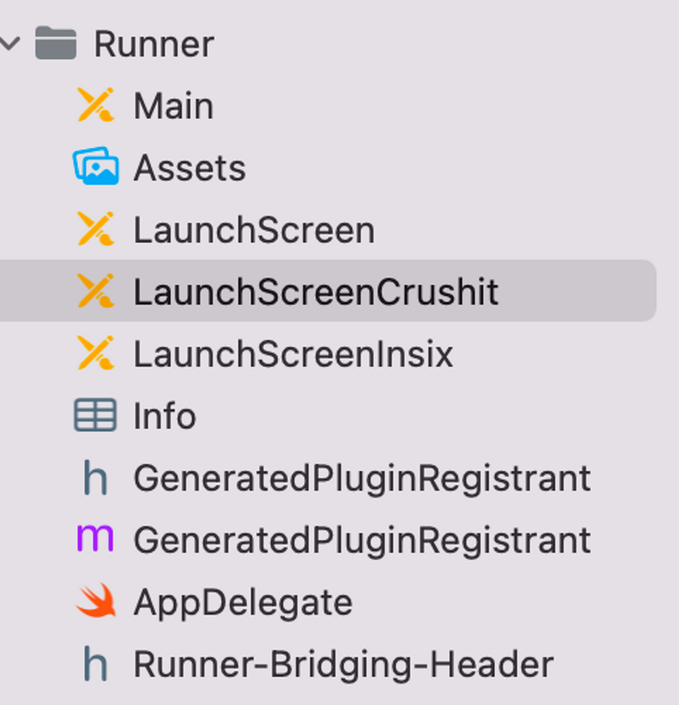

After you drop your files there Xcode will ask you to link them, make sure you select 'Copy if needed'
Go to Target > Runner > Build Settings and add new User defined settings for `LAUNCH_SCREEN_STORYBOARD` and update the launch storyboard for each flavor.
After you finish with that, open the Info.plist file and find key `UILaunchStoryboardName`. The default value is 'LaunchScreen', change that to `$(LAUNCH_SCREEN_STORYBOARD)`

## ***`Firebase`***

Every app will have their android and iOS version

### Android

Provided in [document](https://developers.google.com/android/guides/google-services-plugin?hl=vi#adding_the_json_file), you just put the corresponding `google-services.json` to insix folder and crushit folder.

```code
android/app/src/insix/google-services.json

android/app/src/crushit/google-services.json
```

### iOS

For iOS download GoogleServices-Info.plist, store it in this structure and then just drag and drop **FirebaseConfig** folder to the Xcode

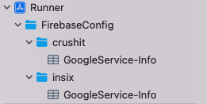

Then we need to add a script which will copy right firebase file on build

```bash
environment="default"

# Regex to extract the scheme name from the Build Configuration
# We have named our Build Configurations as Debug-dev, Debug-prod etc.
# Here, dev and prod are the scheme names. This kind of naming is required by Flutter for flavors to work.
# We are using the $CONFIGURATION variable available in the XCode build environment to extract 
# the environment (or flavor)
# For eg.
# If CONFIGURATION="Debug-prod", then environment will get set to "prod".
if [[ $CONFIGURATION =~ -([^-]*)$ ]]; then
environment=${BASH_REMATCH[1]}
fi

echo $environment

# Name and path of the resource we're copying
GOOGLESERVICE_INFO_PLIST=GoogleService-Info.plist
GOOGLESERVICE_INFO_FILE=${PROJECT_DIR}/FirebaseConfig/${environment}/${GOOGLESERVICE_INFO_PLIST}

# Make sure GoogleService-Info.plist exists
echo "Looking for ${GOOGLESERVICE_INFO_PLIST} in ${GOOGLESERVICE_INFO_FILE}"
if [ ! -f $GOOGLESERVICE_INFO_FILE ]
then
echo "No GoogleService-Info.plist found. Please ensure it's in the proper directory."
exit 1
fi

# Get a reference to the destination location for the GoogleService-Info.plist
# This is the default location where Firebase init code expects to find GoogleServices-Info.plist file
PLIST_DESTINATION=${BUILT_PRODUCTS_DIR}/${PRODUCT_NAME}.app
echo "Will copy ${GOOGLESERVICE_INFO_PLIST} to final destination: ${PLIST_DESTINATION}"

# Copy over the prod GoogleService-Info.plist for Release builds
cp "${GOOGLESERVICE_INFO_FILE}" "${PLIST_DESTINATION}"
```

So just **Add a new run script** in your Build Phases, just underneath the **Link Binary With Libraries**.
    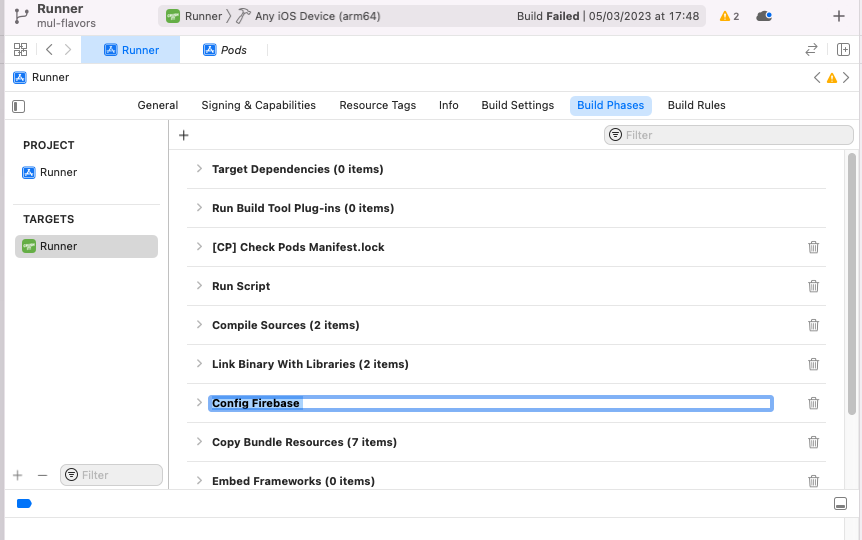

Run the next command to generate corresponding `FirebaseOptions` file for each flavor:

```bash
flutterfire configure \     
--project=${flavor-firebase-project-id} \
--out=lib/firebase_options_${flavor}.dart \
--ios-bundle-id=dev.techfusion.${flavor} \
--android-package-name=dev.techfusion.${flavor}
```

You can delete unnecessary files automatically generated from the above command like:

- root_dir/android/app/google-services.json
- root_dir/ios/firebase_app_id_file.json
- root_dir/ios/Runner/GoogleService-Info.plist

Then import in Dart code:

```dart
import 'firebase_options_crushit.dart';
// or import 'firebase_options_insix.dart'; -->

await Firebase.initializeApp(options: DefaultFirebaseOptions.currentPlatform);
```
