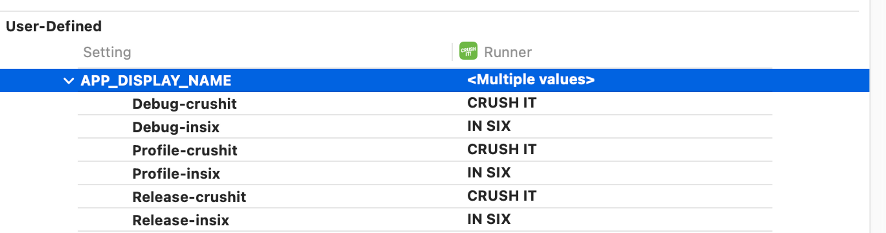
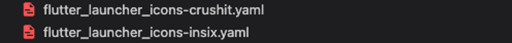

# Setup Multiple Flavors

## ***`Formation`***

### Android

First, setup specific `applicationId` for different flavors in `android` block in `android/app/build.gradle`:


That will handle our app identifier, for now we need to still update **app name** for each version in `android/app/src/main/AndroidManifest.xml` add `app_name`:

```xml
<application
        android:label="@string/app_name"
        ...
>
```

Then create env strings:

```xml
<!-- android/app/src/insix/res/values/strings.xml -->

<?xml version="1.0" encoding="utf-8"?>
<resources>
    <string name="app_name">IN SIX</string>
</resources>
```

```xml
<!-- android/app/src/crushit/res/values/strings.xml -->

<?xml version="1.0" encoding="utf-8"?>
<resources>
    <string name="app_name">CRUSH IT</string>
</resources>
```

### iOS

To set up flavors in iOS once again we’ll need to switch to Xcode to manage schemes.

Xcode ⇒ Product ⇒ Scheme ⇒ New scheme, target stays Runner and add two schemes `insix` and `crushit`


After this, go to Project > Runner and duplicate the Debug, Release, and Profile configurations for each scheme.


Make sure each scheme now points to correct configurations (just right click on scheme and edit)


Go to Target > Runner > Build Settings > Packaging > Product Bundle Identifier to update for each flavor:


And add new User defined settings for APP_DISPLAY_NAME and update the name each flavor.




Also add this variable in InfoPlist for the bundle display name.


## ***`Launcher Icon`***

Install [flutter launcher icons](https://pub.dev/packages/flutter_launcher_icons) package.

Create `flutter_launcher_icons-{flavor}.yaml` in the root directory. Pay attention to the naming (must be a dash, not an underscore); the flavor suffix is important for it to be compatible with each flavor's asset folder.



```groovy
flutter_icons:
    android: "launcher_icon"
    ios: true
    remove_alpha_ios: true
    image_path: "assets/launcher/insix_logo.png"
```

Run the next command:

```bash
flutter pub run flutter_launcher_icons:main -f flutter_launcher_icons*
```

### Android

You're done! No, really, Android doesn't need any additional setup.

### iOS

We need to do this manual for iOS, go to Target > Runner > Build Settings > Asset Catalog Complier - Options > Primary App Icon Set Name:


## ***`Launch Screen`***

Install [flutter_native_splash](https://pub.dev/packages/flutter_launcher_icons) package.

Create `flutter_native_splash-{flavor}.yaml` in the root directory. Pay attention to the naming (must be a dash, not an underscore)


```bash
flutter_native_splash:
    color: "#0d0d0e"
    image: "assets/launcher/insix_logo.png"
```

Run the next command:

```bash
# For insix flavor
flutter pub run flutter_native_splash:create --flavor insix --path=flutter_native_splash-insix.yaml

# For crushit flavor
flutter pub run flutter_native_splash:create --flavor crushit --path=flutter_native_splash-crushit.yaml
```

### Android

You're done! No, really, Android doesn't need any additional setup.

### iOS

- Find the newly created Storyboard files at the same location where the original is `/ios/Runner/Base.lproj` (LaunchScreen.storyboard is default)

    

- Select all of them and drag and drop into Xcode, directly to the left hand side where the current LaunchScreen.storyboard is located already

    

- After you drop your files there Xcode will ask you to link them, make sure you select 'Copy if needed'
- Go to Target > Runner > Build Settings and add new User defined settings for `LAUNCH_SCREEN_STORYBOARD` and update the launch storyboard for each flavor.
- After you finish with that, open the Info.plist file and find key `UILaunchStoryboardName`. The default value is 'LaunchScreen', change that to `$(LAUNCH_SCREEN_STORYBOARD)`

## ***`Firebase`***

Run the next command:

```bash
flutterfire config \
    --project=techfusion-insix \
    --out=lib/firebase_options_insix.dart \
    --ios-bundle-id=dev.techfusion.insix \
    --android-app-id=dev.techfusion.insix
```
